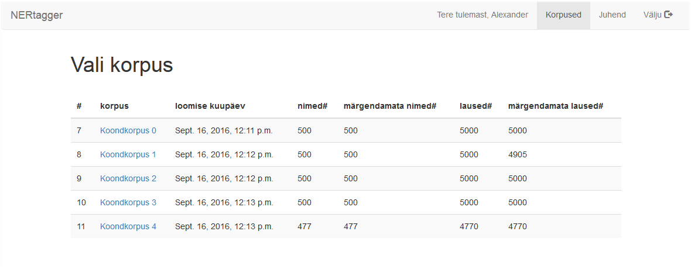
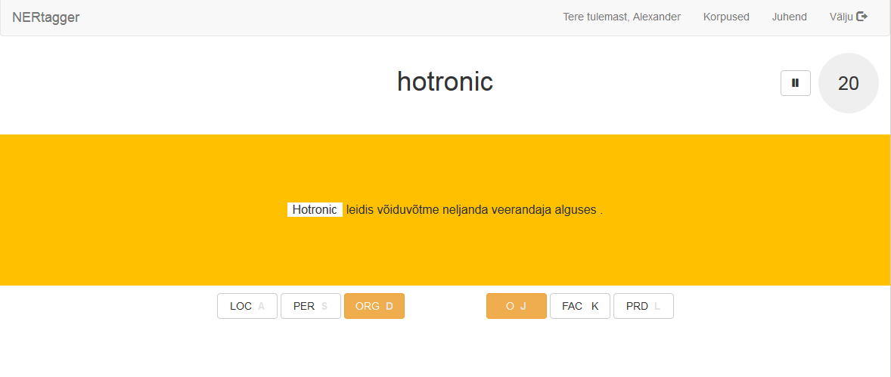
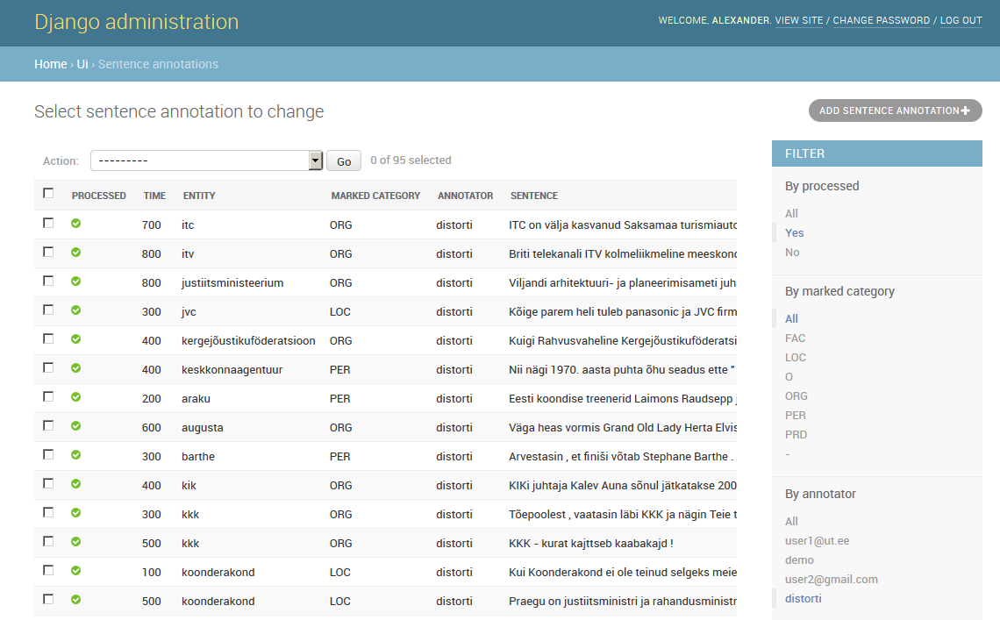

# Ner-tagger
*Ner-tagger* is a web tool which helps linguists manually categorise entities in text.
It has been developed specifically for annotating named entities, where the task it to categorise proper names into a number of semantic types.
The tool, however, can be easily customised for annotation tasks alike.

## Features
* *Ner-tagger* allows to run multiple annotation projects simultaneously,
* supports multiple users,
* comes with a administrative interface to monitor annotation process.

## Use cases
One might find *ner-tagger* useful for the following annotation tasks:

* **Named entity recognition**, where the task is to classify proper names into categories of interest.
* **Sentiment analysis** to annotate polarity of adjectives.

## Installation
See detailed [installation instructions](docs/installation.md).

## Screenshots
The main page lists corpora assigned to a current user.

Once a user picks a corpus to annotate, he is forwarded to the annotation page.

Administration interface enables to monitor annotation progress.

